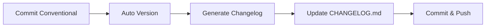

# 📝 Guia de Changelog Automático

## 📖 Visão Geral

Este projeto gera automaticamente um `CHANGELOG.md` a partir das mensagens de commit que seguem o padrão **Conventional Commits**.

O changelog é organizado por versões e categorizado por tipo de mudança.

## 🎯 Como Funciona

### Fluxo Automático



### Análise de Commits

O script analisa commits desde a última tag Git e categoriza por tipo:

| Tipo de Commit | Categoria no Changelog | Emoji |
|----------------|------------------------|-------|
| `feat:` | ✨ Features | ✨ |
| `fix:` | 🐛 Bug Fixes | 🐛 |
| `feat!:` ou `BREAKING CHANGE` | 💥 BREAKING CHANGES | 💥 |
| `perf:`, `refactor:`, `docs:` | 🔧 Other Changes | 🔧 |
| Outros | (ignorado) | - |

## 🚀 Uso

### Gerar Changelog Completo

Gera um `CHANGELOG.md` com todas as versões:

```bash
npm run changelog:generate
```

**Saída:** `CHANGELOG.md` na raiz do projeto

### Gerar Changelog para Versão Específica

Útil para release notes:

```bash
npm run changelog:generate -- --version v1.2.0
```

**Saída:** Conteúdo impresso no console (não salva em arquivo)

### Atualizar Changelog Existente

Adiciona uma nova versão ao changelog mantendo histórico:

```bash
npm run changelog:update -- --version v1.2.0
```

**Saída:** `CHANGELOG.md` atualizado com nova seção no topo

### Gerar desde Tag Específica

```bash
npm run changelog:generate -- --from v1.0.0
```

### Customizar Arquivo de Saída

```bash
npm run changelog:generate -- --output docs/RELEASES.md
```

## 📋 Formato do Changelog

### Estrutura Geral

```markdown
# Changelog

All notable changes to this project will be documented in this file.

The format is based on [Keep a Changelog](https://keepachangelog.com/en/1.0.0/),
and this project adheres to [Semantic Versioning](https://semver.org/spec/v2.0.0.html).

## [Unreleased]

### ✨ Features
- **corpus**: adicionar análise de prosódia ([`abc123`](link))

## [1.2.0](link) - 2024-01-15

### 💥 BREAKING CHANGES
- **api**: refatorar estrutura de dados ([`def456`](link))
  Remove campo `oldField` da resposta da API

### ✨ Features
- **ui**: adicionar tema escuro ([`ghi789`](link))
- adicionar exportação em PDF ([`jkl012`](link))

### 🐛 Bug Fixes
- **corpus**: corrigir cálculo de frequência ([`mno345`](link))

### 🔧 Other Changes
- **docs**: atualizar guia de contribuição ([`pqr678`](link))
```

### Elementos do Changelog

1. **Header da Versão**
   - Número da versão com link para release
   - Data de release (YYYY-MM-DD)

2. **Categorias** (na ordem)
   - 💥 BREAKING CHANGES (se houver)
   - ✨ Features
   - 🐛 Bug Fixes
   - 🔧 Other Changes

3. **Formato do Commit**
   - Scope (em negrito, se presente)
   - Mensagem do commit
   - Hash do commit (como link)

## 🔄 Integração com Auto Version

O changelog é gerado automaticamente quando uma nova versão é criada:

```yaml
# .github/workflows/auto-version.yml
- name: Generate Changelog
  run: npm run changelog:update -- --version ${{ steps.bump.outputs.version }}

- name: Commit Changelog
  run: |
    git add CHANGELOG.md
    git commit -m "docs: update changelog for v${{ steps.bump.outputs.version }}"
    git push
```

## 📊 Exemplos de Commits

### Feature Simples

```bash
git commit -m "feat: adicionar visualização 3D"
```

**Resultado no Changelog:**
```markdown
### ✨ Features
- adicionar visualização 3D ([`abc123`](link))
```

### Feature com Scope

```bash
git commit -m "feat(corpus): implementar análise de prosódia"
```

**Resultado no Changelog:**
```markdown
### ✨ Features
- **corpus**: implementar análise de prosódia ([`abc123`](link))
```

### Bug Fix

```bash
git commit -m "fix(ui): corrigir alinhamento do header"
```

**Resultado no Changelog:**
```markdown
### 🐛 Bug Fixes
- **ui**: corrigir alinhamento do header ([`abc123`](link))
```

### Breaking Change (Método 1)

```bash
git commit -m "feat!: refatorar API de análise semântica"
```

### Breaking Change (Método 2)

```bash
git commit -m "feat: refatorar API de análise semântica

BREAKING CHANGE: Remove método legado analyze() e substitui por analyzeText()"
```

**Resultado no Changelog:**
```markdown
### 💥 BREAKING CHANGES
- refatorar API de análise semântica ([`abc123`](link))
  Remove método legado analyze() e substitui por analyzeText()
```

## 🎨 Personalização

### Customizar Categorias

Edite `scripts/generate-changelog.ts`:

```typescript
function organizeSectionCommits(commits: Commit[]): ChangelogSection {
  const section: ChangelogSection = {
    // ...
    performance: [], // Nova categoria
  };

  commits.forEach(commit => {
    // ...
    else if (commit.type === 'perf') {
      section.performance.push(commit);
    }
  });

  return section;
}
```

### Customizar Formato

Edite a função `formatCommit`:

```typescript
function formatCommit(commit: Commit): string {
  // Adicionar emoji por tipo
  const emoji = {
    feat: '✨',
    fix: '🐛',
    perf: '⚡',
  }[commit.type] || '📝';
  
  return `- ${emoji} ${scopeText}${commit.subject} (${commitLink})`;
}
```

### Adicionar Filtros

Ignorar tipos específicos:

```typescript
const relevantOther = section.other.filter(c => 
  !['test', 'chore', 'ci', 'build'].includes(c.type)
);
```

## 🔍 Detecção de Breaking Changes

O script detecta breaking changes de duas formas:

1. **Exclamação no tipo:** `feat!:`, `fix!:`
2. **Palavra-chave no body:** `BREAKING CHANGE:` seguido de descrição

### Exemplo Completo

```bash
git commit -m "feat(api)!: refatorar sistema de autenticação

BREAKING CHANGE: O método login() agora retorna um objeto User completo
ao invés de apenas o token. Atualize seu código para acessar user.token."
```

**Resultado:**
```markdown
### 💥 BREAKING CHANGES
- **api**: refatorar sistema de autenticação ([`abc123`](link))
  O método login() agora retorna um objeto User completo
  ao invés de apenas o token. Atualize seu código para acessar user.token.
```

## 📦 Versão "Unreleased"

Commits desde a última tag aparecem sob `## [Unreleased]`:

```markdown
## [Unreleased]

### ✨ Features
- **corpus**: adicionar novos domínios semânticos ([`abc123`](link))
```

Quando uma nova versão é criada, essa seção vira a nova versão e uma nova seção Unreleased é criada vazia.

## 🔗 Links nos Commits

Links são gerados automaticamente baseados na URL remota do Git:

```typescript
// SSH
git@github.com:user/repo.git
↓
https://github.com/user/repo/commit/abc123

// HTTPS
https://github.com/user/repo.git
↓
https://github.com/user/repo/commit/abc123
```

Se não houver remote configurado, apenas o hash é exibido sem link.

## 🆘 Troubleshooting

### Changelog vazio

**Causa:** Nenhum commit segue Conventional Commits

**Solução:**
```bash
# Ver commits recentes
git log --oneline -10

# Verificar formato
git log --pretty=format:"%s" -5
```

### Versão não aparece

**Causa:** Commits não foram taggeados

**Solução:**
```bash
# Criar tag
git tag v1.0.0
git push --tags

# Gerar changelog
npm run changelog:generate
```

### Links quebrados

**Causa:** URL remota não detectada

**Solução:**
```bash
# Verificar remote
git config --get remote.origin.url

# Configurar se necessário
git remote set-url origin https://github.com/user/repo.git
```

### Seção duplicada

**Causa:** Executar update duas vezes para mesma versão

**Solução:**
```bash
# Forçar substituição
npm run changelog:update -- --version v1.0.0 --force
```

## 📚 Comandos NPM

Adicione ao `package.json`:

```json
{
  "scripts": {
    "changelog:generate": "tsx scripts/generate-changelog.ts",
    "changelog:update": "tsx scripts/update-changelog.ts",
    "changelog:version": "tsx scripts/generate-changelog.ts --version"
  }
}
```

## 🎯 Boas Práticas

### ✅ Faça

- Use Conventional Commits consistentemente
- Seja descritivo nas mensagens
- Use scopes para organizar mudanças
- Documente breaking changes detalhadamente
- Gere changelog antes de cada release

### ❌ Não Faça

- Editar CHANGELOG.md manualmente
- Misturar mudanças de tipos diferentes em um commit
- Esquecer de adicionar BREAKING CHANGE quando necessário
- Fazer commits sem seguir o padrão

## 🔄 Workflow Recomendado

```bash
# 1. Desenvolver feature
git checkout -b feat/nova-feature

# 2. Fazer commits convencionais
git commit -m "feat(ui): adicionar botão de exportação"
git commit -m "fix(ui): corrigir estilo do botão"

# 3. Merge para main
git checkout main
git merge feat/nova-feature

# 4. Bump de versão (automático no CI)
npm run version:bump

# 5. Gerar changelog (automático no CI)
npm run changelog:update -- --version v1.1.0

# 6. Verificar changelog
cat CHANGELOG.md

# 7. Push (workflow CI faz automaticamente)
git push --tags
```

## 📖 Referências

- [Keep a Changelog](https://keepachangelog.com/)
- [Conventional Commits](https://www.conventionalcommits.org/)
- [Semantic Versioning](https://semver.org/)
- [Git Commit Message Guidelines](https://github.com/angular/angular/blob/master/CONTRIBUTING.md#commit)

---

**Última atualização:** 2024  
**Versão do guia:** 1.0.0
