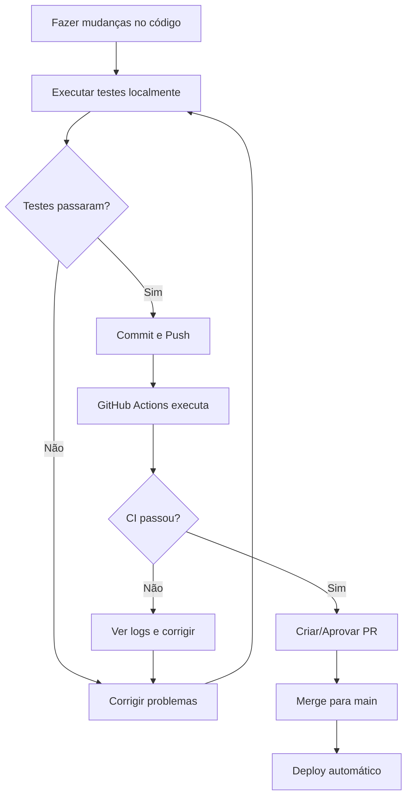

# 🚀 Guia de Deploy com CI/CD

Este documento explica como configurar e usar o sistema de CI/CD para validação automática do corpus antes de cada deploy.

## 📋 Visão Geral

O sistema de CI/CD executa automaticamente testes de integridade do corpus antes de permitir deploys. Se houver falhas críticas, o deploy é **bloqueado automaticamente**.

## 🔧 Configuração Inicial

### 1. Conectar ao GitHub

1. No Lovable, vá em **GitHub → Connect to GitHub**
2. Autorize o Lovable GitHub App
3. Clique em **Create Repository**
4. Os workflows serão sincronizados automaticamente

### 2. Ativar GitHub Actions

As GitHub Actions já estão configuradas e começarão a executar automaticamente quando você:
- Fizer push para `main` ou `develop`
- Criar um Pull Request
- Executar manualmente via interface do GitHub

### 3. Configurar Notificações (Opcional)

Para receber notificações de falhas nos testes:

1. Vá em **Settings → Notifications** no GitHub
2. Ative notificações para **Actions** e **Deployments**

## 🧪 Workflows Disponíveis

### 1. `test-corpus-integrity.yml`

**Quando executa:**
- Push em `main` ou `develop`
- Pull Requests para `main` ou `develop`
- Manualmente via UI do GitHub

**O que faz:**
1. ✅ Executa auditoria de dados
2. ✅ Executa todos os testes de integridade
3. ✅ Gera relatório em JSON
4. ✅ Upload do relatório como artifact
5. ✅ Bloqueia deploy se houver falhas

**Duração:** ~1-2 minutos

### 2. `pre-deployment-check.yml`

**Quando executa:**
- Push em `main` (antes de deploy)
- Pull Requests para `main`

**O que faz:**
1. ✅ Verifica tipos TypeScript
2. ✅ Executa testes do corpus
3. ✅ Gera relatório HTML
4. ✅ Comenta resultados no PR
5. ✅ Bloqueia merge se houver falhas

**Duração:** ~2-3 minutos

## 📊 Scripts NPM

Execute localmente antes de fazer commit:

```bash
# Executar auditoria rápida
npm run test:corpus:audit

# Executar todos os testes
npm run test:corpus

# Gerar relatório HTML
npm run test:corpus:report

# Verificar tipos TypeScript
npm run typecheck
```

## 🚦 Entendendo os Resultados

### ✅ Status: SUCESSO
- Todos os testes passaram
- Deploy pode prosseguir normalmente
- Nenhuma ação necessária

### ⚠️ Status: AVISO
- Testes passaram mas há avisos
- Deploy pode prosseguir
- **Recomendado:** Revisar avisos antes do próximo PR

### ❌ Status: FALHA
- Testes falharam
- **Deploy BLOQUEADO**
- **Ação obrigatória:** Corrigir problemas antes de fazer merge

## 🔍 Acessar Relatórios

### No GitHub Actions

1. Vá em **Actions** no seu repositório
2. Clique no workflow run
3. Baixe o artifact `test-report`
4. Abra `latest-report.html` no navegador

### Localmente

```bash
npm run test:corpus:report
# Relatório salvo em: test-reports/latest-report.html
open test-reports/latest-report.html
```

## 🛡️ Proteções Implementadas

### Branch Protection Rules (Recomendado)

Configure no GitHub para garantir qualidade:

1. Vá em **Settings → Branches → Add rule**
2. Branch pattern: `main`
3. Ative:
   - ✅ Require status checks to pass before merging
   - ✅ Require branches to be up to date before merging
   - Selecione: `quality-gate` e `test-corpus`
4. Salve

Agora é **impossível** fazer merge de PRs com testes falhando!

### Pre-commit Hooks (Opcional)

Para validar localmente antes de commit:

```bash
# Instalar husky
npm install -D husky

# Configurar hook
npx husky init
echo "npm run test:corpus:audit" > .husky/pre-commit
```

## 🚀 Workflow de Desenvolvimento

### Fluxo Recomendado



### Exemplo Prático

```bash
# 1. Fazer mudanças
vim src/data/mockup/corpus-master.ts

# 2. Testar localmente
npm run test:corpus

# 3. Se passou, commit
git add .
git commit -m "feat: adicionar novas palavras ao corpus"

# 4. Push para branch
git push origin feature/novas-palavras

# 5. Criar PR no GitHub
# GitHub Actions executa automaticamente

# 6. Ver resultados no PR
# Se passou, fazer merge

# 7. Deploy automático após merge
```

## 🐛 Troubleshooting

### Problema: Testes falhando no CI mas passando localmente

**Solução:**
```bash
# Garantir que dependências estão atualizadas
npm ci

# Executar com mesmas flags do CI
npm run test:corpus
```

### Problema: Deploy bloqueado mesmo com testes passando

**Verificar:**
1. Status de outros checks (typecheck, lint)
2. Logs completos no GitHub Actions
3. Branch protection rules

### Problema: Testes muito lentos no CI

**Otimizações:**
- Cache de dependências já está configurado
- Testes rodam em paralelo quando possível
- Considera separar testes rápidos de lentos

## 📈 Monitoramento

### Métricas Importantes

Acompanhe no GitHub Actions:
- **Taxa de sucesso** dos builds
- **Tempo de execução** dos testes
- **Frequência de falhas** por suite

### Dashboard de Status

Adicione ao README.md:

```markdown

```

## 🔄 Manutenção

### Atualizar Testes

1. Adicione novos testes em `src/data/mockup/validation/corpusTests.ts`
2. Atualize documentação se necessário
3. Teste localmente antes de commit

### Ajustar Limites

Se precisar ajustar limites de warnings/erros:

Edite `corpusTests.ts`:
```typescript
// Exemplo: Mudar limite de palavras temáticas
test.status = percentualTematico >= 40 && percentualTematico <= 95 ? 'passed' : 'warning';
```

## 📚 Recursos Adicionais

- [GitHub Actions Docs](https://docs.github.com/en/actions)
- [Branch Protection Rules](https://docs.github.com/en/repositories/configuring-branches-and-merges-in-your-repository/managing-protected-branches/about-protected-branches)
- [Lovable GitHub Integration](https://docs.lovable.dev/features/github)

## 🆘 Suporte

Se encontrar problemas:

1. Verifique logs do GitHub Actions
2. Execute testes localmente para debug
3. Consulte documentação em `validation/README.md`
4. Revise o relatório HTML gerado

---

**Última atualização:** 2024
**Mantido por:** Equipe de Desenvolvimento
