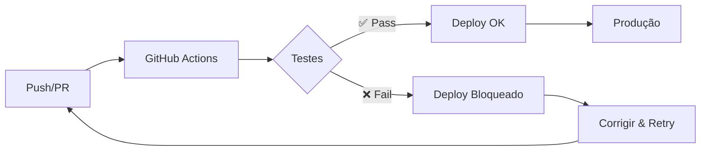

# 🚀 CI/CD e GitHub Actions

Este diretório contém toda a configuração de CI/CD do projeto.

## 📁 Estrutura

```
.github/
├── workflows/                      # GitHub Actions workflows
│   ├── test-corpus-integrity.yml  # Testes de integridade
│   └── pre-deployment-check.yml   # Gate de deploy
├── DEPLOYMENT_GUIDE.md            # Guia completo de deploy
├── SETUP_SCRIPTS.md               # Como configurar scripts npm
├── CI_CD_CHECKLIST.md            # Checklist de configuração
└── README.md                      # Este arquivo
```

## 🎯 Quick Links

- **[📝 Checklist de Setup](CI_CD_CHECKLIST.md)** - Comece aqui!
- **[🚀 Guia de Deploy](DEPLOYMENT_GUIDE.md)** - Processo completo
- **[⚙️ Configurar Scripts](SETUP_SCRIPTS.md)** - Scripts NPM necessários

## 🔄 Workflows

### 1. Test Corpus Integrity
**Arquivo:** `test-corpus-integrity.yml`

Executa em:
- Push para `main` ou `develop`
- Pull Requests
- Manualmente

**O que faz:**
1. Auditoria de dados
2. Testes de integridade
3. Gera relatório
4. Bloqueia deploy se falhar

### 2. Pre-Deployment Check
**Arquivo:** `pre-deployment-check.yml`

Executa em:
- Push para `main`
- Pull Requests para `main`

**O que faz:**
1. Verifica tipos TypeScript
2. Executa testes
3. Gera relatório HTML
4. Comenta no PR
5. Bloqueia merge se falhar

## 🚦 Como Funciona



## ✅ Setup Rápido

**5 minutos para começar:**

1. **Adicionar scripts** ao `package.json`:
   ```bash
   # Ver instruções em SETUP_SCRIPTS.md
   ```

2. **Conectar GitHub**:
   - Lovable → GitHub → Connect

3. **Testar localmente**:
   ```bash
   npm run test:corpus
   ```

4. **Fazer primeiro push**:
   ```bash
   git push
   ```

5. **Ver workflow** em GitHub Actions tab

## 🧪 Executar Localmente

Antes de fazer push, teste:

```bash
# Auditoria rápida (5 seg)
npm run test:corpus:audit

# Suite completa (30 seg)
npm run test:corpus

# Gerar relatório HTML
npm run test:corpus:report
open test-reports/latest-report.html
```

## 🎨 Badges para README

Adicione ao README.md do projeto:

```markdown
[](https://github.com/SEU-USER/SEU-REPO/actions)
```

## 🔒 Proteção de Branch

**Altamente recomendado:**

Settings → Branches → Add rule:
- Branch: `main`
- ✅ Require status checks to pass
- ✅ Require branches to be up to date
- Selecionar: `quality-gate`, `test-corpus`

## 📊 Métricas

Acompanhe no GitHub Actions:
- Taxa de sucesso dos builds
- Tempo médio de execução
- Frequência de falhas
- Cobertura de testes

## 🐛 Troubleshooting

### Workflow não executa
- Verificar permissões do GitHub App
- Ver se workflows estão no repositório
- Checar branch trigger no workflow

### Testes falhando
1. Executar localmente
2. Ver logs detalhados
3. Corrigir dados do corpus
4. Re-executar

### Deploy bloqueado
1. Ver status checks no PR
2. Clicar em "Details"
3. Ver logs completos
4. Corrigir problema
5. Push novamente

## 📚 Documentação Completa

Para guias detalhados, consulte:

- **Setup**: [CI_CD_CHECKLIST.md](CI_CD_CHECKLIST.md)
- **Deploy**: [DEPLOYMENT_GUIDE.md](DEPLOYMENT_GUIDE.md)
- **Scripts**: [SETUP_SCRIPTS.md](SETUP_SCRIPTS.md)
- **Testes**: [../src/data/mockup/validation/README.md](../src/data/mockup/validation/README.md)

## 🤝 Contribuindo

Melhorias nos workflows são bem-vindas!

1. Edite workflow localmente
2. Teste com `act` ou GitHub Actions
3. Documente mudanças
4. Abra PR

## ⚡ Performance

Otimizações já implementadas:
- ✅ Cache de dependências npm
- ✅ Testes paralelos quando possível
- ✅ Build incremental
- ✅ Artefatos comprimidos

## 🔐 Segurança

- Secrets gerenciados via GitHub Secrets
- Permissions de least privilege
- Audit logs disponíveis
- Branch protection enforced

## 📞 Suporte

Problemas com CI/CD?

1. Verificar [Troubleshooting](#-troubleshooting)
2. Ver logs do workflow
3. Consultar documentação
4. Abrir issue se necessário

---

**Mantido por:** Equipe de Desenvolvimento
**Última atualização:** 2024
